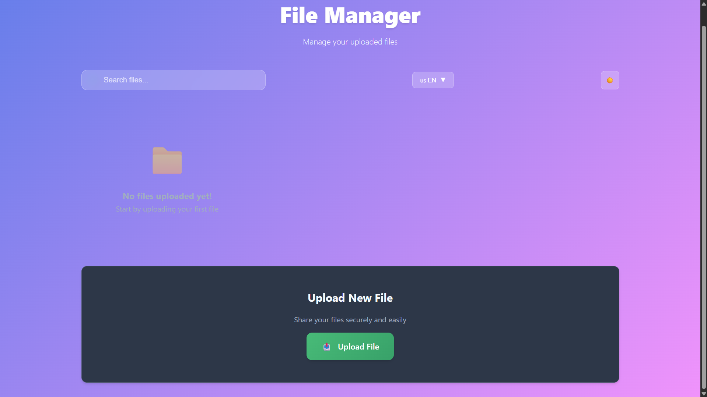
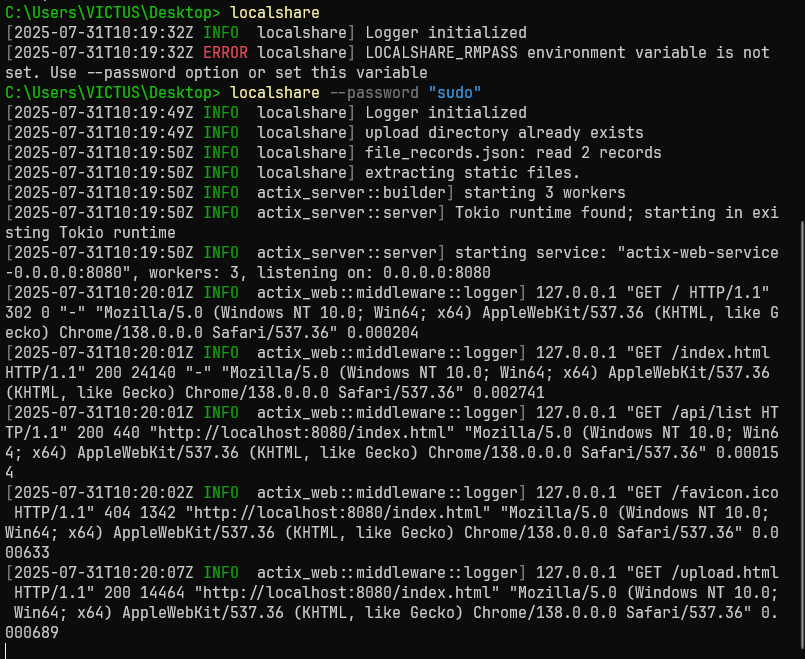

# LocalShare

LocalShare is a Rust-based application designed to facilitate secure and efficient file sharing over local networks. This project aims to provide a simple, fast, and user-friendly way to transfer files between devices without relying on external servers or internet connectivity.

## Screenshots






## Features

- **Cross-platform**: Works on Windows, macOS, and Linux.
- **Easy to Use**: Simple command-line interface.
- **No Internet Required**: Transfers files directly over your local network.

## Installation

1. **Clone the repository:**
    ```bash
    git clone https://github.com/erbekin/localshare.git
    cd localshare
    ```

2. **Build the project:**
    ```bash
    cargo build --release
    ```

3. **Install the program:**
    ```bash
    cargo install --path .
    ```
    > If you don't want to install, run `cargo run --release -- <your options>` in the project root directory.

## Usage

When you run `localshare` in a directory, inside that directory the uploads directory will be created. When you run in the same directory localshare continues to work in that directory.
You can manually specify the upload directory using `-d`option.
Static files will be extracted to `<upload_dir>/static` directory.
For more help, run `localshare --help` 

## License

This project is licensed under the MIT License. See [LICENSE](LICENSE) for details.

## Acknowledgements

- [Rust Programming Language](https://www.rust-lang.org/)
- [Actix Web](https://actix.rs/)
- [Tokio](https://tokio.rs/)
- [Serde](https://serde.rs/)
